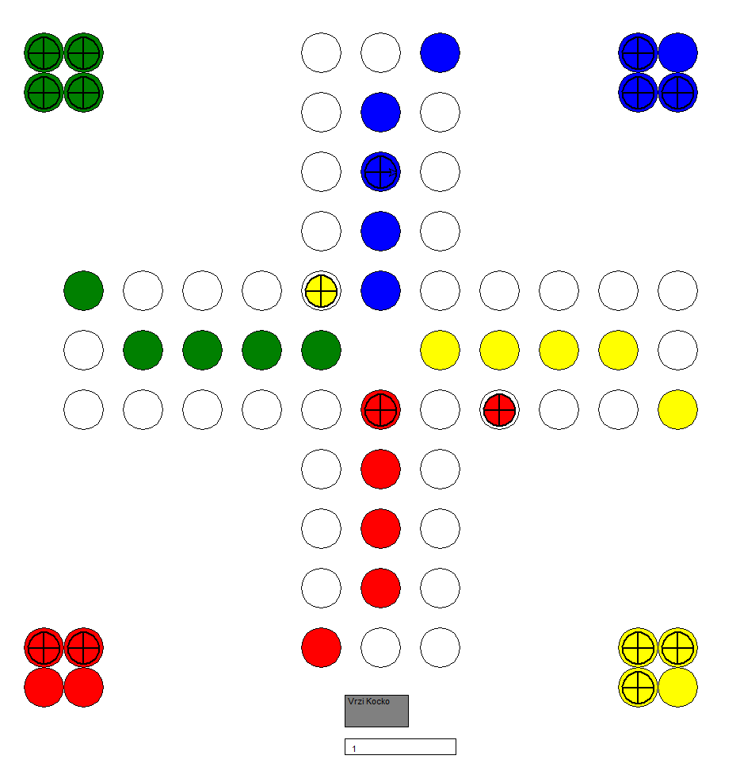

# Človek ne jezi se
## Informatika - projekt

#### Kako igrati?
Na začetku, ko poženete program vas vpraša po barvi, ki jo želite igrati. Izberite jo in program bo nato narisal igralno ploščo. Ko je narisana kliknite na gumb, da vržete kocko. Vaša figura se premakne in na potezi so nasprotniki. Ko se njihove poteze končajo, vržite kocko še enkrat dokler ne zmagate.

